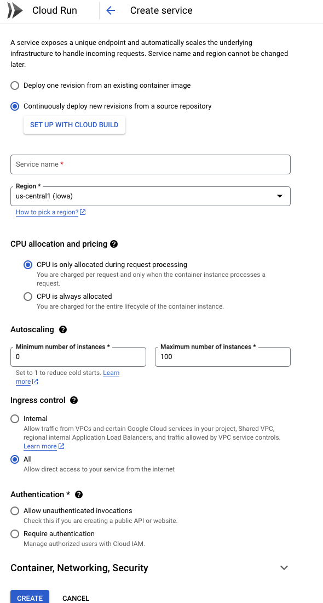

# [Deploy notes](https://www.frontendeng.dev/blog/6-deploying-nextjs-app-on-cloud-run-ci-cd):

## Create a Project
Google Cloud Platform has a concept of Project. A project should map to a real world project you are working on. Each project will be billed separately and you can delete a project and all associated services with it pretty quickly.

Follow [these](https://cloud.google.com/resource-manager/docs/creating-managing-projects) instructions to create a new project. It does not matter what name you pick for your project.

You do not want to accidently consume too much resources and get a surprise credit card bill. For this make sure you [setup a billing alert](https://cloud.google.com/billing/docs/how-to/budgets#add-new-budget) for a reasonable amount like $100.

## Install gcloud command line tool.
We do recommend installing gcloud command line tool as an optional step. With this tool you can do many things with a simple command which otherwise would take you lot longer to do through the web UI.
- [Install the gcloud cli by following these steps.](https://cloud.google.com/sdk/docs/install)
- [Set it up with the right credentials](https://cloud.google.com/sdk/docs/initializing#initialize_the) so it is actually usable.


## Prepare your repository for containerization
### What is a container ?
If you are not familiar with Docker container images, I can explain it in few sentences. When you develop a NextJS app (or any other server app) you expect to run it in certain environment. For example Linux so and so version, with so and so nodejs version installed, with so and so environment variables and such. Dockerfile is a way you describe this environment and how to build and run your app.

Any cloud platform that can understand this container can look at your Dockerfile and precisely create this exact environment to run your app. You never have to worry about the OS, hardware and any surprise updates to OS or underlying software.

### Add a Dockerfile to your repository's root folder.
```docker
FROM node:20.10.0-alpine
RUN mkdir /app
COPY package.json /app/
WORKDIR /app
COPY . ./

RUN npm install
RUN npm run build
EXPOSE 3000
CMD ["npm", "run","start"]
```
Read more about these [Dockerfile directives here](https://docs.docker.com/engine/reference/builder/).


## Setting up Google Cloud Run
- Visit [Google Cloud Run page](https://console.cloud.google.com/run) and click on Create Service.
- A long form will come up. Select the option **Continuously deploy new revisions from a source repository**.
- Click on the **Setup with Cloud Build** button which opens up a Wizard.
- In this Wizard you can connect you Github account with Google Cloud, select the repository you created and pick "Dockerfile" as an option.
- Select **allow unauthenticated invocations** in the form and press save.
- Everything else can stay default though I prefer to keep "minimum number of nodes" to zero to keep my costs low.

The following image should give you an idea.


## Wait for the app to get deployed on Cloud Run

As soon as you have created the cloud run service, it will execute the build trigger which will automatically fetch the latest code from your repo and create an image using the Docker file you created earlier.

It will deploy that image to Cloud Run automatically.

The public URL for your cloud run endpoint will be displayed after the service is created. It is often of the form : https://service_name-random_string-region_code.a.run.app

You can click on this link and see you app running. If you want a custom domain for this app it is possible to add one. Please see the instructions to [map your domain name to cloud run](https://cloud.google.com/run/docs/mapping-custom-domains) ([video](https://www.youtube.com/watch?v=lDtvpUYAFzA)).

**Note that Google does not allow custom domains if your Cloud Run service is in some regions like Mumbai. In those cases you will have to use Firebase forwarding service (free) or a load balancer (expensive).**


## Troubleshooting
Like all things devops things may not work smoothly in the first run. Following things can go wrong.

### Cloud build fails
To check whether the build itself was successful you can visit Google Cloud Build page. Here you can see the history of all builds that were triggered and the logs. If something went wrong you will see it in logs.<br>
Most of the times what can go wrong is actually something in your Dockerfile or NextJS build step. <br>
NextJS build can always be tested locally by running ```npm run build | npx next build``` <br>
Fix the issues, commit your code and push to Github. Google Cloud build will automatically trigger another build by detecting this push.


### Cloud run deployment fails
One of the most common reason for this failure is that you might not have set the environement variables in Dockerfile properly or the resources like memory was too less. However for this particular project I do not think you will face any issus.

### Adding more features to the NextJs app
What if you want to add mysql and prisma support ? It is very simple. Just create a new mysql instance in Google cloud and modify your prisma file and deploy again.

Things you can consider doing when deploying to Google Cloud Run.
- Use Google Cloud Storage to store uploaded files in your app.
- Use Google Cloud Sql to use a mysql like RDBMS.
- Use Sendgrid to send emails from your nextjs app.

### Performance
Note that Google will keep the nodes 0 when there is no traffic. When the first request comes in, Google will bring up a new node and run it. This might take time. So the first request would be relatively slower. But subsequent requests are fast enough.

You can avoid this problem by configuring Cloud Run to keep at least one node alive all the time but then you will end up paying for it 24x7.


<br><br><br><br><br><br><br><br><br><br><br><br><br><br><br><br>
APIs:
- Cloud Build API
- Cloud Source Repositories API
- Identity and Access Management (IAM) API


Cloud Build:
Mirrored repository in google cloud from github.
Create triggers that listen to pushes on specific branches and build and deploys the site.

Cloud run to host website
Buy domain on simply
Figure out DNS
Figure out certificate


VPC Network -> IP addresses -> Reserve External Static IP Address
It uses forwarding rule

Network Services -> Load Balancing Create Load Balancer
Frontend has HTTPS Protocol that uses reservec external IP with certificate chain
It also uses a compute backend


Security -> Certificate Authority Service > CA Pool Manager -> Create CA
OR
Certificate Manager and let Google Manage Load Balancer Certificates?